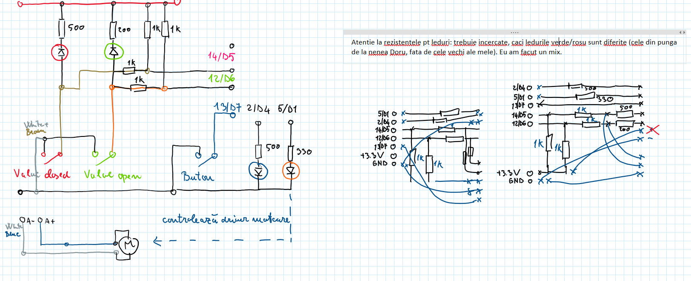

# esp8266-robinet-put

Acasa nu am apa curenta, ci am un put cu hidrofor. Acolo exista un robinet (clasic/mecanic) pentru a intrerupe la nevoie alimentarea cu apa. 

Aceasta intrerupere e o practica buna, in special in timpul absentelor indelungate. E.g. racordurile flexibile pentru WC, chiuveta, masina de spalat: intrebarea este: cand se fisureaza. Nu "daca" se fisureaza. Ideal ar trebui sa se intample asta cand sunt acasa, nu cand sunt plecat, ca sa ma trezesc cu ditamai inundatia.

In cazul meu (put/hidrofor) e dificil sa cobor periodic in put. Deci am dorit sa instalez un robinet electric, pe care sa-l actionez cu ceva buton din casa.

Acum exista robineti care au o mica electronica integrata; deci comanda se face doar cu un comutator. Insa la vremea cand l-am cumparat eu, nu am gasit un model din asta. Modelul meu are un motor si contacte de capat de cursa. Deci userul trebuie sa foloseasca un mic microcontroller (ESP8266/NodeMCU in cazul meu). In asta consta acest proiect. Insa am observat pe pielea mea, ca sunt multe diferente intre un mic/trivial proiect cu breadboard + jump wires vs. ceva suficient de robust pentru "productie".

# Lessons learned (si istoric)

In 2019 am inceput ditamai mini-framework OOP (cf. branch `arhiva-cod-versiuni-precedente`). Am avut probleme si nu am pus in prod. In 2022 am reluat si pus in prod proiectul. Iata cam ce am invatat, in majoritatea cazurilor "the hard way", in urma a mult timp si cod scris/incercat.

1/ Am vrut hot reload (pt o super experienta de dev). Teoretic e facubil. Practic, am reusit insa nu l-am putut reutiliza in practica. In primul rand necesita o separare si disciplina a codului. Ca sa fie module. Fara ea 1/ nu prea mergea sau 2/ mult mai probabil, mergea, dar ramaneau memory leak. Si nu era deloc evident ce a produs memory leak. Si dupa 1-2 reload nu mai avea placuta memorie. Parca am avut si o pb cu dimensiunea unui fisier individual. Consecinta: am renuntat.

2/ Am vrut sa pun pe ac placuta si modulul de robinet, si cel pt irigatie. Mi-am dat seama tarziu ca nu am suficienti pini k lumea. Desi placa are multi pini, multi au cate un quirck. Si in practica in jur de 4 pini (poate putin mai mult) sunt folosibili relativ fara restrictii. Consecinta: am spart in 2 programa, gandindu-ma ca folosesc 2 placute.

3/ Am facut clasa de logger. 1/ daca nu aveam grija cu intreruperile & co, produceam corupere. 2/ am redus o problema pana la un scenariu mic, in care cred ca procedam corect, dar tot produceam corupere. Corupere = se sterge tot FS-ul placutei. 3/ flash-ul ESP nu e facut sa superte asa multe scrieri. Consecinta: am renuntat.

4/ Lucrul cu pini ca callback. Nu sunt fiabili. Cand frec un pin de shield (simuland buton), se produc mii de microcontacte. Iar placa are o memorie circulara, si pierde anumiti handleri. Trebuie deci poll.

5/ Pull-up resistor. Parca mi s-a ars o placa la un mom dat. Sau doar un pin? Sau mai precis internal pull-up-ul sau? Oricum, lumea nu recomanda folosirea internal pull-up. Am pus deci externi. Si in plus am pus si in serie unii, gandindu-ma ca poate mai atenueaza din curentii paraziti. Care BTW sunt multi. Cred ca motorul are mult zgomot, si genereaza "micro contacte" pentru firele catre contactele de capat de cursa. Am pus link-uri mai jos.

6/ Blynk: din 2023 s-a schimbat versiunea si trebuie abonament. Am renuntat. Sper sa am timp sa convertesc catre MQTT pt integrare cu Home Assistant.

7/ Nu prea merita de fapt folosit esp, in primul rand pentru flow-ul greoi de lucru de la distanta. Se poate, dar nu e fiabil. Mult mai bun un Raspberry. Conexiune SSH stabila, etc. Poate pentru oameni care au zeci de placute, e diferit.

# Flashing the micropython firmware (Windows)

Installed https://docs.conda.io/en/latest/miniconda.html.
Opened (from Start Menu) "Anaconda Prompt ..."
http://docs.micropython.org/en/latest/esp8266/tutorial/intro.html#deploying-the-firmware
* `pip install esptool` works
* `esptool.py --port /dev/ttyUSB0 erase_flash` is indeed: `python -m esptool --port COM3 erase_flash`
The small ESP8266 board (AI Thinker / Node MCU) need a driver for the USB to serial converter: https://www.silabs.com/developers/usb-to-uart-bridge-vcp-drivers?tab=downloads. Downloaded [this](https://www.silabs.com/documents/public/software/CP210x_Universal_Windows_Driver.zip) Go to Device Manger > Update driver and point to the dir (extracted from the archive)
* `python -m esptool --port COM3 --baud 460800 write_flash --flash_size=detect 0 esp8266-20220618-v1.19.1.bin`

# Development flow / tools

## Developing w/ uPyLoader (Windows, deprecated)

**UPDATE:** acum privilegiez lucrul de la distanta (i.e. prin raspberry care e conectat la esp). Nu ma forteaza sa stau in pozitie incomoda si cu firul dupa mine.

uPyLoader-win.exe cf. https://github.com/BetaRavener/uPyLoader. For upload and terminal via serial. Or even via WiFi.

The executable file starts slowly, and the transfer via wifi is broken.

For last version (w/ proper WiFi support), clone the repo and use it from there, cf. [here](https://github.com/BetaRavener/uPyLoader/wiki/Running-uPyLoader-from-source). Then, `python main.py`.

To interact w/ the progam via the terminal/REPL, e.g.:

```
from program import *
someFunc() # asta fiind definita in program; merge si cu variabile; e.g. de tip Pin
```

UPDATE: some modules are now already imported in `boot.py`. Press `tab` to see what's available.

You can write also in the "output" box. No cursor is shown. But "tab" auto complete is enabled.

"-D" button on the right, means soft reboot. In the past I made `reloadutil.py`. It did work, having some limitations though. However, in 2022, I didn't feel the need to use it any more, using the "soft reset" technique cf. above.

## Developing w/ pymakr-vsc (Windows, deprecated)

**UPDATE:** Am incercat o scurta perioada. Avea ceva glitch-uri; workaroundabile. Parca a murit insa proiectul odata cu firma. Si oricum ramane valabila remarca cu lucrul de pe rasp.

## Developing from Rasberry PI (conected via USB to esp)

### minicom

Lucru cu consola la modul generic: https://www.makeuseof.com/connect-to-serial-consoles-on-linux/ sau https://help.ubuntu.com/community/Minicom

```bash
dmesg | grep serial
```
Si se vede  ceva de genul:

```
[   27.217164] usbcore: registered new interface driver usbserial_generic
[   27.217365] usbserial: USB Serial support registered for generic
[   27.245811] usbserial: USB Serial support registered for ch341-uart
[   33.076772] uart-pl011 3f201000.serial: no DMA platform data
```

Care pare e atasat lui `/dev/ttyUSB0`.

```bash
# l-am preluat din doc rshell, dar era mentionat si aici
sudo usermod -a -G dialout $USER

sudo apt-get install minicom
sudo minicom -s
# setare port = ttyUSB0, save as dfl; iesire;
# -m inseamna sa nu folosest e.g. ctrl + a, x pt iesire, ci alt, x. Pentru ca ctrl + ... e deja folosit de MicroPython
minicom -m
```

Newline si apoi CTRL + D, face reset. Daca dupa repornire se apasa repede pe CTRL + C, atunci opreste programul. Mi-a fost util cand un callback dadea periodic exceptie poluand REPL.

### rshell

https://github.com/dhylands/rshell

```bash
sudo apt-get install python3-pip
## asta NU merge
# sudo pip3 install rshell

# cf. https://github.com/dhylands/rshell/issues/27#issuecomment-846667994, caci e nevoie sa folosesc argumentul -s care cred ca nu exista in versiunea publicata
python -m pip install git+https://github.com/ropg/rshell.git

# cf. link de mai sus + https://forum.micropython.org/viewtopic.php?t=11427&p=62503, linia de comanda este
rshell -p /dev/ttyUSB0 --buffer-size=30 -a -s
```

Exemplu de sesiune:

```bash
ls /pyboard
cp /pyboard/logger.py logger.py
# modificare fisier cu nano
cp logger.py /pyboard/logger.py
repl
# apasat ctrl + d pt reset; iesire cu ctrl + x
```

### Redirect serial in fisier

**UPDATE:** am renuntat la asta. Suspectez ca din cauza acestui redirect, si a afisarii in bucla a erorii de "blynk server not available", s-a stricat complet un card SD bun al rasp.

```bash
# pt capturare serial in fisier, cf: https://askubuntu.com/questions/347340/how-to-dump-raw-serial-data-to-disk
# UPDATE: nu merge bine. Dupa ce porneste sistemul, nu e configurat portul, si afiseaza prost. Merge doar dupa ce am folosit e.g. rshell
(stty raw; cat > received.log) < /dev/ttyUSB0

# am facut ~/redirect-serial-file.sh, cf. https://unix.stackexchange.com/a/372096
stty -F /dev/ttyUSB0 115200 raw -echo
exec 3</dev/ttyUSB0
/home/pi/cat-linked-for-redirect-serial <&3 >> /home/pi/serial.log

# am facut acest link ca sa vedem cu ps ce proces este
sudo ln /usr/bin/cat ~/cat-linked-for-redirect-serial   

# si apoi in /etc/rc.local am pus
/home/pi/redirect-serial-file.sh &
```

# Preconizare dev

Cand voi relua lucrul, as face checkout la ac proiect pe rasp. De asta l-am pus pe GitHub (in loc de GitLab): sa nu fie pb de VPN. Si m-as conecta din VS Code cu ajutorul extensiei SSH FS. + rshell.

# Documentatie relevanta

## Shield cu driver motoare

https://forum.micropython.org/viewtopic.php?t=3977

https://www.instructables.com/Motorize-IoT-With-ESP8266/

## Pinout si particularitati GPIO

https://randomnerdtutorials.com/esp8266-pinout-reference-gpios/

https://www.esp8266.com/wiki/doku.php?id=esp8266_gpio_pin_allocations

## Diferente intre NodeMCU (v2, cu colturi rotunjite) si Lolin (v3, putin mai mare, cu colturi patrate)

https://diyi0t.com/esp8266-nodemcu-tutorial/

Mai sunt si alte pagini similare.

## Linkuri interesante

https://www.digikey.com/en/articles/protecting-inputs-in-digital-electronics

https://learn.sparkfun.com/tutorials/pull-up-resistors/all

https://forum.arduino.cc/t/about-pull-up-resistors/512333/5

# Schite (capturate din fisierul OneNote alaturat)




